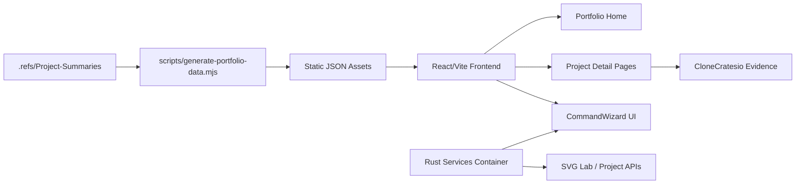

# Aptlantis Studio


Aptlantis Studio is a project portfolio and evidence-led teaching surface for the Aptlantis ecosystem.

Turn `aptlantis.studio` into a dark, compact, evidence-led site that teaches what each project does and how to use it.


Quick links: [Architecture](#architecture-at-a-glance) | [Quickstart](#quick-start) | [Operations](#operational-guidance) | [Release Notes](#roadmap)

---

## What This Project Covers

| Area | Summary |
|------|---------|
| Portfolio | Home page driven by normalized project analyzer output. |
| Education | Project pages teaching overview, installation, and evidence. |
| CloneCratesio | Curated media and a schema-driven command builder. |
| CommandWizard | Client-side MVP for constructing tool commands. |
| Rust Services | Container-ready API host for Command Builder, SVG Lab, and future Studio services. |
| Ecosystem | Integration of projects from analyzer outputs. |
| Design | Dark, compact, evidence-led UI replacing legacy distro layouts. |

---

## Verified Result

Use this section for the strongest evidence that the project works: a benchmark, production run, release validation, demo screenshot, test result, customer workflow, migration record, or completed operational milestone.

| Metric | Value |
|--------|-------|
| Project Count | `~10+` |
| Build System | `Vite` |
| UI Framework | `React` |
| Styling | `Tailwind` |
| Date verified | `2026-07-08` |
| Result | Site builds cleanly and renders portfolio data from JSON. |

The site successfully transitions away from Linux-distro mirror language to a modern project portfolio focused on curated evidence and operator guidance.

---

## Architecture at a Glance



The architecture is designed for a static site (SPA) that consumes pre-processed project metadata and curated evidence.

---

## Repository Layout

```text
aptlantis.studio/             Main frontend project directory
aptlantis.studio/src/         React source code
aptlantis.studio/public/      Static assets and schemas
aptlantis.studio/services/    Rust service containers and deployment examples
webserver/                    Infrastructure configuration (Caddy, Docker)
.refs/                        Reference data and screenshots
aptlantis.studio.manifest.toml Project manifest and mission
```

---

## Components

### `Portfolio Home`

The primary entry point that lists Aptlantis projects using normalized data from the analyzer.

- Filterable project cards
- Maturity and status indicators
- Direct links to project details

### `CommandWizard`

A schema-driven UI component for building and validating command-line strings for various tools.

- TOML-based command schemas
- Real-time command string generation
- Validation and copy-to-clipboard support

### `Rust Services`

A container-ready Axum service under `aptlantis.studio/services/aptlantis-services`.

- Health and service registry endpoints
- Command Builder schema API backed by the existing static schema catalog
- Dockerfile and compose example for the Fedora host stack
- Planned expansion point for SVG Lab validation, project indexing, and site settings services

### `CloneCratesio Detail`

A specialized view for the CloneCratesio project highlighting curated media and operational evidence.

- Video and screenshot gallery
- Integrated CommandWizard for installation
- Terminal output logs

---

## Data, Storage, or Artifact Model

Use this section to explain what the project creates, consumes, stores, or transforms.

| Artifact | Purpose |
|----------|---------|
| `portfolio.json` | Normalized project metadata for the home page. |
| `command-schemas/` | TOML/JSON definitions for tool arguments. |
| `project-summaries/` | Source markdown and metadata for detail pages. |
| `curated-media/` | Screenshots and videos used for evidence. |

The project transforms raw analyzer output from `.refs` into optimized JSON consumed by the React frontend.

---

## Manifest and Audit Trail

If this project has a machine-readable manifest, logs, run records, release records, database migrations, checksums, or generated metadata, explain them here.

Common record fields:

- `id`: Unique project identifier.
- `title`: Display name of the project.
- `status`: Current development stage (draft, active, paused).
- `mission`: High-level goal of the project.
- `success`: Specific criteria for completion.
- `failure`: Anti-patterns to avoid.

| Status | Meaning |
|--------|---------|
| `draft` | Initial proposal and design phase. |
| `active` | Ongoing development and maintenance. |
| `paused` | Development on hold, but remains functional. |

Managed via `aptlantis.studio.manifest.toml`.

---

## Observability

Use this section for logs, dashboards, health checks, metrics, status APIs, diagnostics, debug tools, or validation commands.

| Surface | Purpose |
|---------|---------|
| `Browser Console` | Client-side error tracking and debug logs. |
| `Vite Dev Server` | Local development and HMR feedback. |
| `GET /api/health` | Rust service readiness for Caddy, Cloudflared, and Docker health checks. |
| `GET /api/services` | Registry of ready and planned Studio service modules. |
| `Caddy Logs` | Access and error logs for the production container. |

Important signals:

- `Lighthouse Score`: Performance and accessibility metrics.
- `Build Time`: Efficiency of the Vite build pipeline.
- `JSON Load Time`: Latency of static data fetching.
- `Command Validity`: Success rate of generated command strings.

---

## Quick Start

### Prerequisites

- Node.js (v18+)
- pnpm (v9+)
- Docker (optional, for webserver)

### Setup

```powershell
cd aptlantis.studio
pnpm install
```

### Build

```powershell
pnpm build
```

### Run

```powershell
pnpm dev
```

Run the Rust service:

```powershell
pnpm --dir aptlantis.studio services:dev
```

Build the Rust service Docker image:

```powershell
pnpm --dir aptlantis.studio services:docker
```

### Verify

```powershell
pnpm lint
pnpm format:check
pnpm --dir aptlantis.studio services:check
```

---

## Primary Workflow

To update the portfolio data after an analyzer run:

```powershell
# Update references in .refs/
# Run the generation script
pnpm import-all
# Preview the changes
pnpm dev
```

Expected output:

```text
[portfolio-gen] Loaded 12 projects from .refs
[portfolio-gen] Normalized command schemas for CloneCratesio
[portfolio-gen] Successfully wrote public/data/projects/portfolio.json
```

---

## Operational Guidance

- Keep project schemas in sync with upstream tool changes.
- Ensure media assets in `.refs` are optimized for web delivery.
- Use `pnpm dev:all` to run both the frontend and the mock data server if needed.
- Validate the site against the WDS delivery standard.
- Avoid introducing legacy "distro" terminology into new routes.

---

## Development

Build:

```powershell
pnpm build
```

Test:

```powershell
# Standard test suite
pnpm test
```

Format or lint:

```powershell
pnpm format
pnpm lint
```

Current automated coverage includes linting, formatting, and TypeScript type checking.

---

## Documentation Map

| File | Purpose |
|------|---------|
| [Project Proposal](aptlantis.studio/docs/Project-Proposal.md) | Vision and success criteria. |
| [Manifest](aptlantis.studio/aptlantis.studio.manifest.toml) | Machine-readable project metadata. |
| [Architecture](aptlantis.studio/docs/Architecture.md) | (Planned) Detailed system design. |
| [Release Notes](aptlantis.studio/docs/Release-Notes.md) | (Planned) Version history. |

---

## Release Posture

Aptlantis Studio is in early development (draft stage), focusing on core portfolio features.

| Field | Value |
|-------|-------|
| Stage | draft |
| Completion | 40% |
| Stability | alpha |
| Technical debt | low |
| Maintenance burden | low |
| License | CC0-1.0 |
| Maintainer | Herb |

---

## Core Principles

**Evidence-Led**
Every project entry should be supported by screenshots, logs, or benchmarks.

**Operator-Focused**
Prioritize "how to use" and "how to verify" over abstract descriptions.

**Machine-Readable**
Use structured data (JSON/TOML) to drive the UI rather than manual HTML.

**Anti-Distro**
Explicitly move away from legacy mirror/ISO/torrent concepts for a cleaner portfolio.

---

## Roadmap

- [x] Initial Proposal
- [ ] Portfolio Home (Analyzer-driven)
- [ ] Project Detail Pages
- [ ] CommandWizard MVP
- [ ] CloneCratesio Evidence Integration

---

## License

CC0-1.0 License. See [LICENSE](LICENSE) for details.

---

## Author

Maintained by Herb.

```html
<script type="application/ld+json">
{
  "@context": "https://schema.org",
  "@type": "SoftwareSourceCode",
  "name": "Aptlantis Studio",
  "description": "Project portfolio and evidence-led teaching surface for the Aptlantis ecosystem.",
  "license": "https://creativecommons.org/publicdomain/zero/1.0/",
  "programmingLanguage": ["TypeScript", "JavaScript", "React"],
  "author": {
    "@type": "Person",
    "name": "Herb"
  }
}
</script>
```
